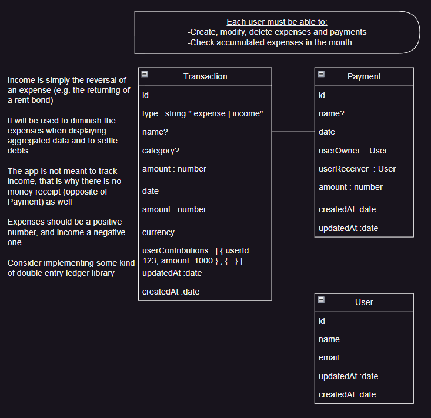

Go to specsAndEntities.drawio to find the entities model and understand what the repo is about

Tech stack:
- Nest.js
- Prisma ORM
- PostgreSQL
- JWT/ passport.js / argon2
- Jest (testing still todo)
